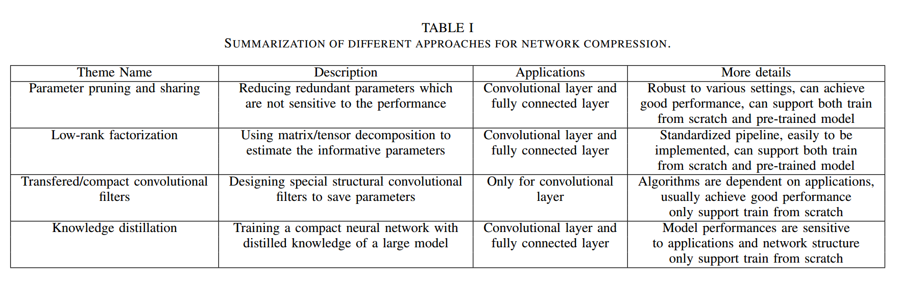
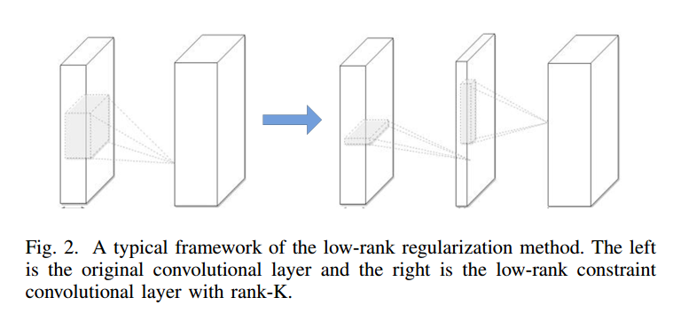
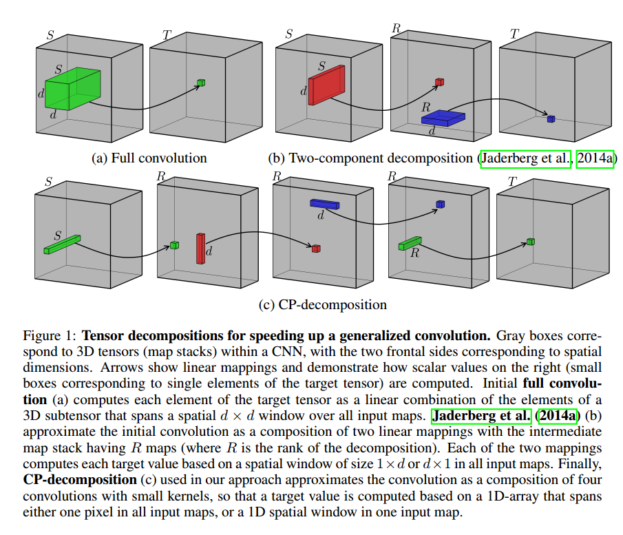
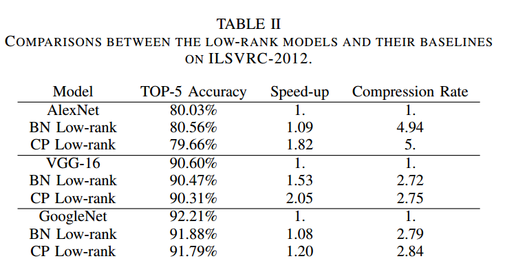
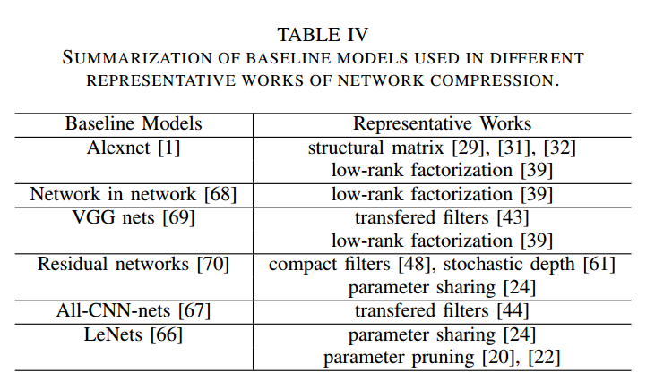

作者：Yu Cheng / Duo Wang / Pan Zhou / Tao Zhang

发表时间：2017-10-23

论文链接：https://arxiv.org/pdf/1710.09282.pdf

# Abstract
当前的DCNN模型计算复杂度高且存储密集，很难在低内存资源的设备或具有严格延迟要求的应用中部署它们。因此，不降低模型性能情况下，希望能够做到模型的压缩和加速。近年来，压缩和加速模型得到方法主要是四个方案：参数修剪与共享、低秩分解、转移/压缩卷积滤波器和知识精炼。这篇文章首先介绍这四种方案，对每种方案都分析其性能、相关应用和优缺点。然后再及诶少一系列比较成功的方法。之后，调查评估矩阵，用于评估模型性能的主要数据集和最近的基准测试工作。最后就是说一下挑战和未来发展方向。

# Introduction
- 参数修剪与共享。基于参数修剪与共享的方法主要探索模型参数的冗余，并且去除冗余和不重要的参数。

- 低秩分解。基于低秩分解的方法用矩阵/张量分解分解来估计DCNN的信息参数。

- 转移/压缩卷积滤波器。基于转移/压缩卷积滤波器的方法主要是减少存储和计算复杂度。

- 知识精炼。知识精炼主要是学习一个精炼模型并且训练一个更紧凑的神经网络，以达到再现巨大经网络的输出。

表一可以看到参数修剪和分享、低秩分解以及知识精炼的方法都可以用在卷积层和全连接层，而转移/压缩滤波器则只用于卷积层。低秩分解和转移压缩滤波器的方法使用的是端到端的pipeline，适合CPU/GPU环境。而参数修剪和共享使用不同的方法，如矢量量化，二进制编码和稀疏约束来执行任务，它通常需要几个步骤才能达到目标。

关于训练，基于参数修剪/共享低秩分解的模型可以从预先训练的模型中提取或者从头开始训练。 转换/压缩滤波器和知识精炼模型只能支持从零开始训练。 这些方法是独立设计但相辅相成的。 例如，转移层和参数修剪/共享可以一起使用，并且模型量化和二值化可以与低秩近似一起使用以实现进一步的加速。 

# 参数修剪与共享(Parameter pruning and sharing)
## A. 量化和二值化(Quantization and Binarization)
- 网络量化通过减少表示每个权重所需的比特数来压缩原始网络。

- 修剪不重要的连接并重新训练稀疏连接的网络。

- 在每个权重的1比特表示的极端情况下，即二进制加权神经网络，也有许多直接训练二进制权值的CNN。 主要思想是在模型训练期间直接学习二进制权重或激活。

**缺陷**：①二进制网络在处理大型CNN（如GoogleNet）准确性显着降低。 ②现有的二进制化方案是基于简单的矩阵近似，并忽略了二值化对精度损失的影响。 为了解决②，近似的对角线Hessian近似牛顿算法[16]，该算法直接将与二进制权重有关的损失最小化。通过随机二值化权重和隐藏状态计算中的乘法转换，减少训练阶段中浮点乘法的时间 [17]。

## B. 修剪和共享(Pruning and Sharing)
- 可以降低网络复杂度并且定位过拟合的单元。Biased Weight Decay是最早的pruning方法。而Optimal Brain Damage和Optimal Brain Surgeon是減少了基于Hessian损失函数的连接数。

- 最近的趋势是去除冗余。HashNets、Haffman编码等。

- 系数约束。如$l_0$和$l_1$范数正则。①[25]对卷积滤波器施加了群稀疏约束；②在[26]中，在训练阶段引入了一组关于神经元的稀疏正则化矩阵，以减少滤波器学习紧凑CNN。 ③在每层上增加了一个结构稀疏正规化器[27]。 所有上述工作都使用了$l_{2, 1}$范数正规化器。 [28]中的工作使用$l_1$范数来选择和修剪不重要的过滤器。

**缺陷**：①L1、L2范数需要更多的迭代来收敛。②需要手动设置所有层的灵敏度，需要对参数进行微调。

## C. 设计结构矩阵(Designing Structural Matrix)
全连接层的参数数量非常多，因此探索全连接层的参数冗余是非常重要的。非线性转换$f(x, M) = \sigma(Mx)$的时间复杂度是$O(mn)$，直观方法是将x变成参数化的结构矩阵。可以使用比mn少得多的参数来描述的m×n矩阵称为结构化矩阵。①基于循环预测的方法，使得$O(d^2)$变成$O(d)$还可以使用快速傅里叶变换(FFT)来加速。②Adaptive Fastfood transform。

**缺陷**：①结构约束(Structural Constraints)会导致准确性损失，因为约束可能会给模型带来偏差。 ②很难找到合适的结构矩阵，没有理论的方法来推导出它。

# 低秩分解和稀疏(Low-Rank Factorization and Sparsity)

低秩矩阵的经典框架
卷积需要大量的计算量，所以减少卷积的层数可以提高压缩率和加速。卷积核可以看成4维的张量。4D张量中含有大量冗余，张量分解的思路也由此而来。对于全连接层，可以看出2D矩阵，所以可以使用低秩方法。

使用低阶滤波器来加速卷积。例如高维DCT（离散余弦变换）和使用张量积的小波系统分别由1D DCT变换和1D小波构成。学习可分离的1D滤波器由Rigamonti等人提出 [35]。关于一些简单的DNN模型，在[36]中提出了一些卷积核的低秩近似和聚类方案。他们为单一卷积层实现了2倍加速，分类精度下降1％。文献[37]中的工作提出使用不同的张量分解方案，报告4.5倍加速，文本识别精度下降1％。低阶逼近是逐层完成的。完成一层的参数后，根据重建误差准则对上述层进行微调。这些是压缩二维卷积层的典型低秩方法，如图2所示。遵循这个方向，对[38]中的核张量提出了Canonical Polyadic（CP）分解。他们的工作使用非线性最小二乘法来计算CP分解。在文献[39]中，提出了一种用于从头开始训练低秩受限CNN的低秩张量分解的新算法。它使用批量标准化（BN）来转换内部隐藏单元的激活。

向量分解用于广义卷积，来自[38]

下面是低秩模型及其基线模型在 ILSVRC-2012 数据集上的性能对比：

基于低秩矩阵方法的各种baseline比较

缺陷：对于模型压缩和加速，低秩方法很简单。①实现不容易，涉及分解操作，计算复杂度不低。②当前方法一层一层地执行低秩近似，因此不能执行全局参数压缩（全局参数压缩就像不同层承载不同信息一样重要）。 ③与原始模型相比，因式分解需要广泛的模型重新训练来实现收敛。

# 迁移 /压缩卷积滤波器(Transferred/Compact Convolutional Filters)
探索输入图像的平移不变特性，训练非深度模型成功的关键是CNN的参数有效性（不会严重过拟合）。 虽然目前缺乏强有力的理论，但大量的实证支持了一个观点，那就是平移不变性和卷积权重共享对于良好预测性能都很重要。从经验来看，DCNNs也受益于使用大量卷积滤波器，通过将特定变换T（·）应用于一小组基滤波器，因为它起了正则化的作用。

缺点：首先，这些方法在广泛/平坦的体系结构（如VGGNet）可以提供有竞争力的性能，但不能与窄小/特殊的体系（如GoogleNet，Residual Net）相媲美。其次，转移假设有时过于强大以至于无法指导算法，导致某些数据集的结果不稳定。

使用紧凑的卷积滤波器可以直接降低计算成本。关键的想法是用紧凑的模块代替松动和超参数滤波器，以提高速度，这在几个基准上显着加速了CNN。[47]使用了将3×3卷积分解为两个1×1卷积的方法，该方法在物体识别上实现了最先进的加速性能（详细结构看[47]，block图非常清晰）。 SqueezeNet 是[48]提出的模型，它用1×1卷积代替3×3卷积，SqueezeNet创建了一个紧凑的神经网络，参数少于50，准确度相当与AlexNet。

# 知识精炼(Knowledge Distillation)
知识精炼模型最早由Caruana等人提出[49]，他们训练了带有伪标签的强分类器的压缩/集成模型，并且产生原始较大网络的输出。但是这个工作仅限于浅层网络。这个想法最近被[50]所采用作为知识精炼，将宽度和深度的网络压缩成比较浅的网络。基于KD的思想主要是通过软化的softmax学习教师模型的分布，将大的教师模型变成较小的教师模型。

[51]中的工作引入了KD压缩框架，通过遵循学生 - 教师范式来缓解深度网络的训练。学生接受了预测教师输出的训练，以及真实的分类标签，将深层网络（教师）的集合压缩成类似深度的学生网络。 [52]中的工作旨在通过利用深度神经网络来解决网络压缩问题。它提出了一种方法来训练薄而深的网络，称为FitNets，以压缩宽而浅（但仍然很深）的网络。

 [53]的工作训练了一个参数化学生模型来逼近蒙特卡罗教师模型。[54]与之前使用软标签概率表示知识的方法不同，主要通过使用更高隐藏层中的神经元来表示知识，该神经元保存尽可能多的信息作为标签概率，但更紧凑。[55]将知识从以前的网络瞬时转移到新的更深或更广的网络，以加速实验过程。

**缺陷**：缺基于KD的方法可以使更深的模型变得更浅，显着降低计算成本。 但是KD只能用于具有softmax损失函数的分类任务；另一个缺点是，模型假设有时过于严格，竞争力不够。

# 其他类型的方法
